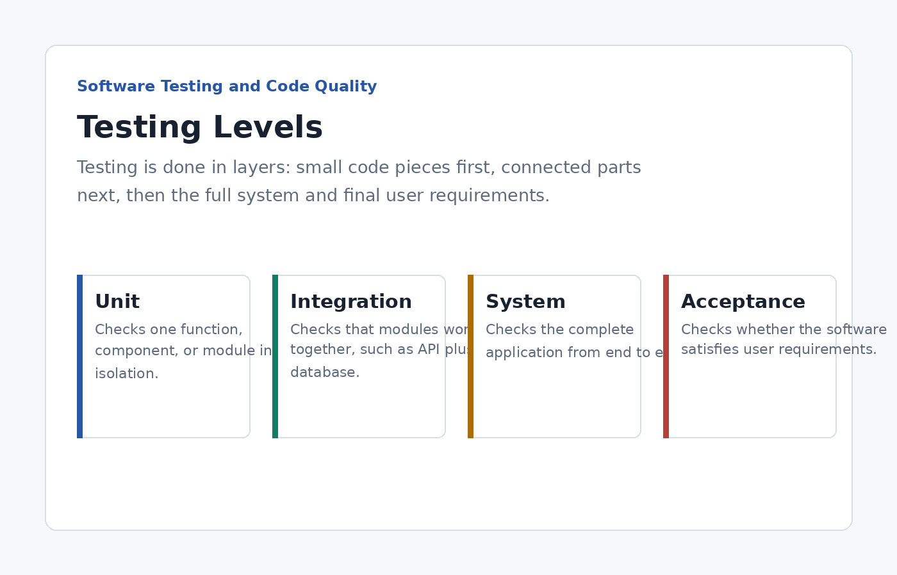
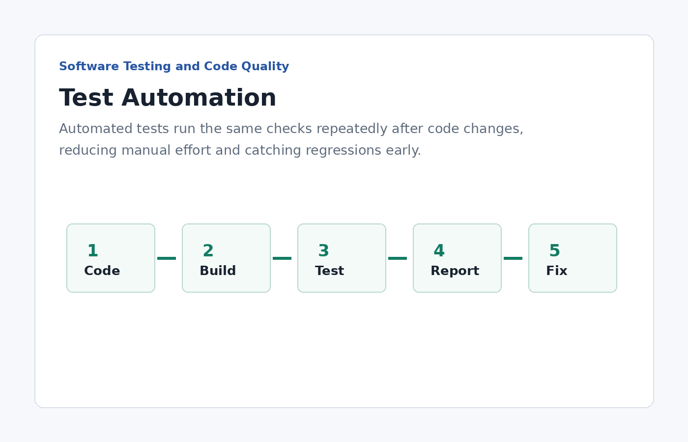
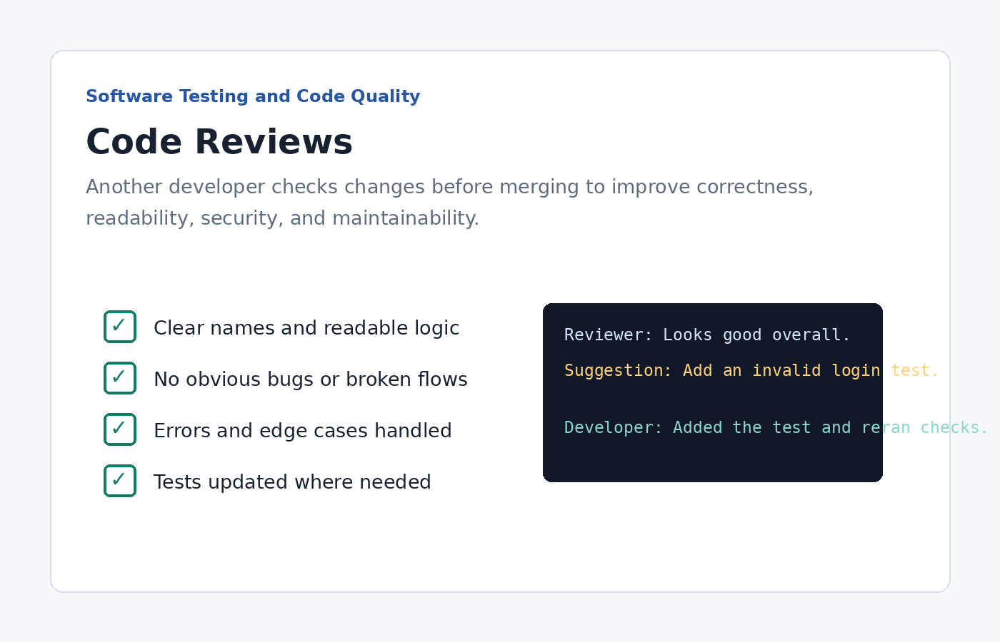
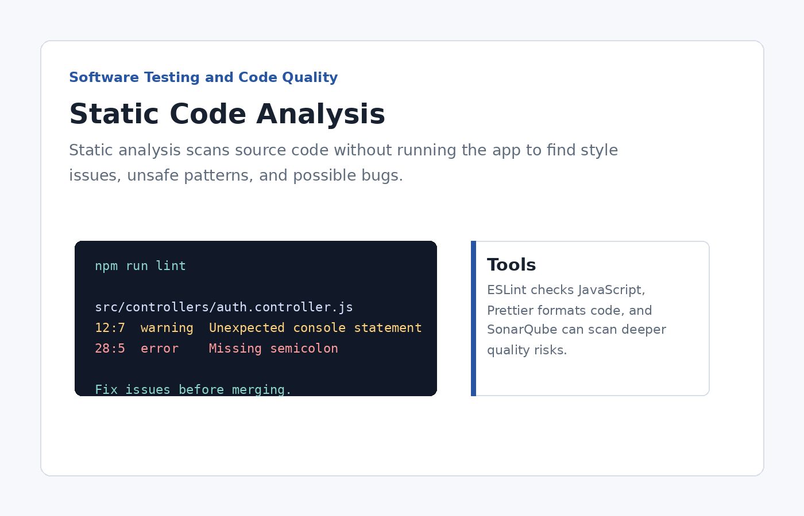
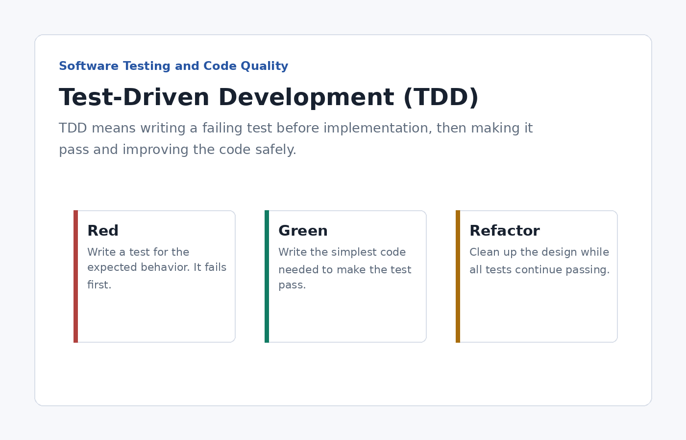

# Software Testing and Code Quality

## Unit, Integration, System, and Acceptance Testing

Testing is done in layers. Unit tests check small pieces of code, integration tests check connected parts, system tests check the whole application, and acceptance tests confirm the software meets user requirements.

## Test Automation

Test automation uses scripts and tools to run checks repeatedly without manual effort. It helps teams catch bugs quickly whenever code changes.

## Code Reviews

Code reviews happen when another developer checks a change before it is merged. They improve readability, correctness, security, and maintainability.

## Static Code Analysis

Static code analysis scans source code without running the application. It finds style issues, unused variables, risky patterns, and possible bugs.

## Test-Driven Development (TDD)

Test-driven development is a process where tests are written before the code. The cycle is red, green, and refactor: write a failing test, make it pass, then improve the code.

